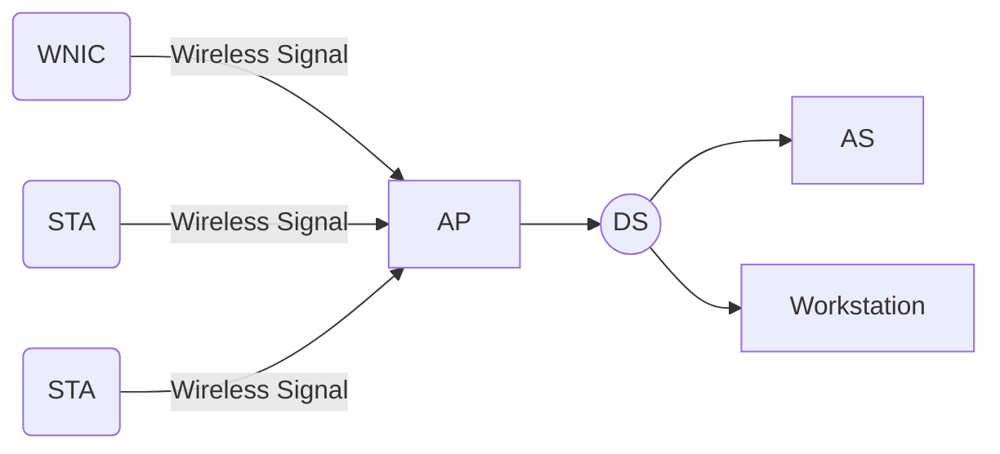
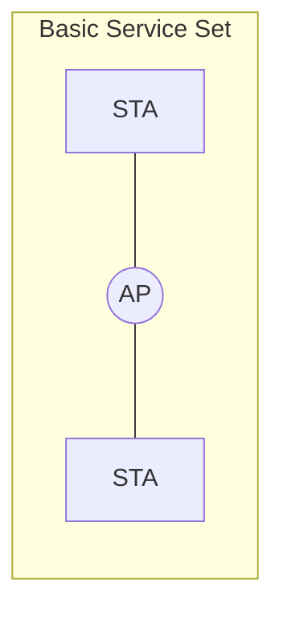
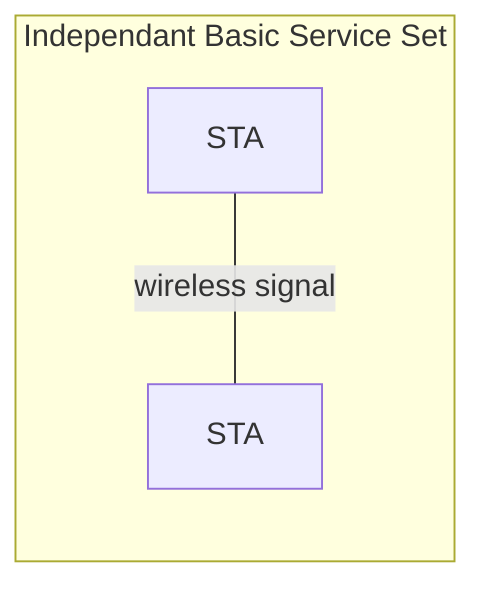
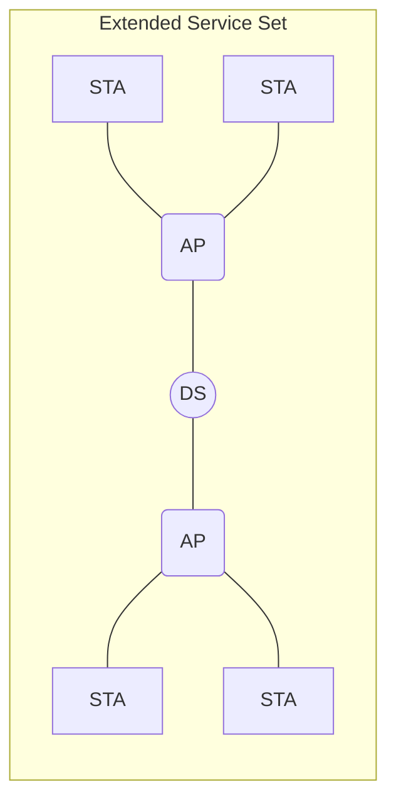

# Wireless Hacking

## Wireless Network Background

### the IEEE 802.11 Standard and Wi-Fi (wireless fidelity)

the `IEEE 802.11 Standard` is a technical specification for implementing `Wireless Local Area Network` or `WLAN's`. this standard was established in 1997 by the `IEEE (Institute of Electrical and Electronics Engineers)` and descripts the depths of deploying wireless networks that enable mobiles to access wireless networks.

Today the `standard` defines many versions of the 802.11 wireless netwoks, which are depicted by the below table:

|                   | 802.11a | 802.11b |  802.11g   | 802.11n  |
| ----------------- | :-----: | :-----: | :--------: | :------: |
| Release Date      |  1999   |  1999   |    2003    |   2009   |
| Maximum Data Rate | 54 Mbps | 11 Mbps |  54 Mbps   | 150 Mbps |
| Frequency         |  5 GHz  | 2.4 GHz |  2.4 GHz   | 2.4 GHz  |
| Modulations       |  ODFM   |  DSSS   | OFDM, DSSS |   OFDM   |

in 1999, to fix the interoperability (`adj`, the exchange of information between computer systems) issues, a number of vendors got together to create the `WECA (Wireless Ethernet Compliance Alliance)`, which was later named to `Wi-Fi (Wireless Fidelity Aliiance)` in 2002. A Non-profit organization who's mission is to assure that wireless devices meet the standards put out by organizations like the IEEE.

## Contents

- [Componets of a Wireless Network](#Components-of-a-Wireless-Network)
- [Wireless Architecture](#Wireless Architecture)
- [Wireless Network Operations](#Wireless Network Operations)
- [Structure of the wireless transimission messages](#Structure of the wireless transimission messages)
  - [Main Frames and Subtypes](#Main Frames and Subtypes)
  - [Wireshark Table](#Wireshark Table)
- [WEP Security](#WEP Security)

### Components of a Wireless Network

Main Components:

* `(WNIC) Wireless Netowork Interface Card` - A specially designed circuits that emits and receives wireless signals, and is the key component for any device looking to gain access to Wireless Networks.
* `(STA) Station` - This is ALWAYS a client device, and is anything that contains a `WNIC`
* `(AP) Access Point` - This will ALWAYS play the role of a server device in a netowork. an `AP` is the key part of a wireless network, it allows `STA's` to gain access to wired networks.
* `(AS) Authentication Server` - This is the server that holds of the `STA's` data in a database. The `AS` is accessed by the `AP` everytime an `STA` attempts to gain access to the wireless network. The `AS` is not always present in networks, in simple `SOHO's (Simple Office Work Office)` the `AS` can  be found within the `AP`.
* `(DS) Distribution System` - this is the system responsible for communication between the wireless network and the wired network. Commonly, the wired network will be the common Ethernet (802.3 standard). In some cases where two `AP's` need to communicate, to support data roaming, the `DS` will be another wireless network.



## Wireless Architecture

These are the following types of architecture that exist:

* `(BSS) Basic Service Set` - the `BSS` consists of 1 `AP` and 2 `STA's`. the `AP` plays the role of the forwarding node, and forwards all the wireless communications from either `AP` to the other (or to the wired network if a `DS` is available). This is also known as `Infastructure Mode`. 



* `(IBSS) Independant Basic Service Set` - An `IBSS` only takes 2 `STA's` and works like a `peer-to-peer` network. One `STA` takes the responsibility of transmitting the `beacons` and authenticating new members to the netowork. All `STA's` communicate directly in this type of architecture.



* `(ESS) Extended Service Set` - This is a collection of `BSS's`, where the `AP's` in each `BSS` are communicating with each other with the use of the `DS`. This kind of architecture allows for user roaming.



## Wireless Network Operations

~~basics~~

Every `Access point (AP)` emmits a special packet called a `beacon`. This `beacon` sends a signal about 10x's every second and is responsible for transmitting important information such as:

* Name (SSID)
* Supported data rates
* Signaling Methods
* Synchronization
* data
* other useful info to help the receiving `(STA) station` join the network

When a `STA` activates it's `(WNIC) wireless network interface card`, the `STA` immediately starts scanning all available `channels (frequencies)` for `beacons` (the `AP`). The `STA` will then select the `AP` with the strongest signal, or follow the `beacons`  with the strongest supporting data, security, etc. This is known as `Passice Scanning`.

Alternatively, an `STA` can emmit a `Probe Request Message` to all channels and wait for an `AP` to reply with a `Probe Response Message`. This method is often quicker for the devices as it involved direct detection and selection. This is called `Probe Response Scanning`.

Once an `STA` has selected an `AP` to connect to, it begins to send an `Authentication Request` in order to prove it's identity. There is a lot of data involved with this request which is covered late, but assuming everything goes successfully, the next step is for the `AP` to return an `Authentication Response`. Then the `STA` proceeds to the connection phase and sends an `Association Request` which is responded with an `Association Response` from the `AP`. Once the connection is successful, the `STA` and the `AP` can then start exchanging data/messages.

```sequence
STA->AP: Probe Request
AP->STA:Probe Response
STA->AP:Authentication Request
AP->STA:Authentication Response
STA->AP:Association Request
AP->STA:Association Response
STA->AP:User Data
```

## Structure of the wireless transimission messages

here are the different frames in the top level of the frame anamatomy:

| preamble | PLCPHeader | MAC Header | Data | CRC  |
| -------- | ---------- | ---------- | ---- | ---- |
|          |            |            |      |      |

`Mac Header` leads to more of the more parts of the frame:

| Frame Control | Duration ID | Address #1 | Address #2 | Address #3 | Sequence Control | Address #4 | Frame Body | FCS |
||||||||||
||


And `Frame control then leads to the 3rd and bottom most layer of the frame anatomy:

| Protocol Version | Frame Type | Frame Subtype | To DS | From DS | More Fragments | Retry | Power Mgt | More Data | WEP | Order |
||||||||||||
||


All of these frames contribute to the anatomy of the wirelessly transmitted information:

* `Preamble` - This frame contains the bytes in the message that help the `sender` and `receiver` to `synchronize`.
* `PLCP` - The PLCP frame holds the bytes which controls the negotiation between transmission rates of each sessions, fragmentation of packets, etc
* `MAC Header` - From a security perspective, the `MAC header` is the most important frame of wireless tranmissions as it contains the `source` and `desination` address' of the frames, and also contains the `association` and `authentication` requests between the `STA` and `AC`.
* `Data` - this contains the real sending and receiving data between `STA's`
* `CRC` - the (Cyclic Redundancy Check) contains information that helps the transmitter and the receiver to quickly detect errors.

Stemming from the most important of these frames, we look into the `MAC header` and see how each frame contributes here:

* `Frame control` - this contains the:
  * type
  * subtype
  * transmission direction
  * fragmentation
  * reassembly details
  * encryption parameters
* `Duration ID` - This frame usually controls the or requests the `time` that a `STA` has to wait before it can either send a specific frame, or how long it has to wait for availability of the transmission medium.
* `Sequence Control` - This is for the fragmentation process and is used to organize transmitted frames.
* `Address#1-4` - the 4 addresses correspond with the `Destination Address`(the final device to receive the tranmission), `Source Address`(origin device of the tranmission), `Transmitter Address` and the `Receiver Address`. To help understand this, lets take an example: we have a `BSS` where `STA-1` send's a message to `STA-2`. `STA-1` will be sending their tranmission to the `AP`, in this step, `STA-1` = **Source Address** & **Transmitter Address**, `STA-2` = **Destination Address**, `AP` = **Receiver Address**. Then, when the `AP` forwards the tranmission to it's **Desnitaiton Address** (`STA-2`) the `AP` = **Transmitter Address** and `STA-2` = **Receiver Address** & **Destination Address**, all the while `STA-1` remains the **Source Address**.

```sequence
STA1(Source)--AP: Source Address | Transmitter Address
STA1(Source)--AP:  Receiver Address
AP--STA2(Destination): Transmitter Address | Destination address
AP--STA2(Destination): Receiver Address
```

* `Frame Body` - This field contains the real data of the frame, in case of a Management or Data type frame.
* `FCS` - (Frame Check Sequence) is used by `STA's` to check integrity of received frames.

Now we peak into the 3rd and lowest most level of the frame anatomy, and this one is under the `Frame Control` frame:

* `Protocol Version` - Contains the current version of the 802.11 protocol. All `STA's` must be able to support the version number in order to join the wireless network.
* `Type` - There are 3 types of Frames in Wireless tranmissions: **Data**, **Control** and **Management**.
* `Subtype` - the exact function of the frame.
* `To DS` - Indicates if the frame is going towards the `DS (Distribution System)`
* `From DS` - Indicates of the frame is coming from the `DS`
* `More Fragments` - Indicates if more fragments of thee current frame will follow.
* `retry` - Indicates if the frame is being retransmitted.
* `Power Management` - Indicates if the `STA` is operating in power saved mode.
* `More Data` - It is ised by the `AP` to inform the `STA` that more frames will follow.
* `WEP` - Indicates if the transmitted frame uses encryption and autehntication.
* `Order` - Indicates that all received data frames must be processed in order.

### Main Frames and Subtypes

Within all of theses, there are pn `3 types of frames`, and a number of subtypes defined in the `802.11 standard`. They are:

* **Management frames**
* **Control Frames**
* **Data Frames**

The `Management Frames` help to establish and maintain the connection between the `receiver` and the `sender` in a wireless network. `Data Management Frames` come into different versions to be able to support the different tasks. Will the network models available above, have a look at the `securoty management subtype frames`:

* *Beacon Frames* - the `beacon` is a frame that transmits roughly about 10 times every second. The `beacon` is essentially a signal emmitted from the `AP` advertising itself to any `STA` for connection. The signal emmits a `Service Set Identifier (SSID)` which contains the name of the wireless network. An `AP` can be configured in such a way that it **stops** emitting the `SSID`, which makes it difficult to stop **unauthorized** users from accecssing the network


* _Probe Request Frame_ - This is a frame that is emitted from an `STA` when it is in `active scanning mode`. It is an extremely quick way of identifying all of the available `AP'`, however, this is also the loudest way to advertise yourself, and makes you **extremely** vulnerable to `Wireless Intrusion Detection Systems (WIDS)`.

```sequence
title: Active Scanning Mode
participant STA
participant WIDS
note over WIDS:WIDS can detect frames
STA-->AP:probe request frame
```


* _Probe Response Frame_ - this frame is a response to the `Probe Request Frame`, and contains all the usefull information like supported data rates, etc.

```sequence
participant STA
participant WIDS
AP-->STA:Probe Response Frame
```


* _Authentication Frame_ - This is considered the most important frame as it contains all the user information about the `STA` and the `AP`. In the simplest mode where an `Authentication Frame` is uses (`BSS`), **only 1** `Authentication (request) Frame` is sent from the `STA` and **only 1** `Authentication (response) Frame` is sent from the `AP`.

```sequence
participant STA
participant AP
STA-->AP: Authentication Frame
AP-->STA: Authentication Response
note right of AP: This frame is only ever sent once
```

* _Deauthentication Frame_ - The `Deauthentication Frame` is sent from the `STA` when it decides to leave the network. the `STA` will send a `Deauthentication Frame` to the `AP`, in which when the `AP` receives the subtype frame, will immediately disconnect the `STA`. This subtype frame will be used in a lot of attacks as it is the easiest way to force information from the clients (info like `SSID's`, `authentication handshakes`, etc)

```sequence
participant STA
participant AP
STA-->AP:Deauthentication Frame
note left of AP:The AP won't return a frame,\n instead, it disconnects the STA
```

* _Association Request Frame_ - this is transmitted after the `authentication phase` has been successfully completed. The `STA` sends the `AP` supported connection technologies along with the `SSID` the `STA` wants to connect to. (**Note**: an `AP` can emmit multiple `SSID's` simultaneoulsy.)

```sequence
STA-->AP:Assocation Frame
note left of AP:STA will send supported data\n like SSID, data support etc.
```

* _Association Response Frame_ - if the `AP` accepts the `Association Request Frame`, then an `Assocation Response Frame` is sent from the `AP`. The `AP` will then allocate the required hardware to support the `STA's` connection to the wireless network.
* _Reassociation Frame_ - This is used a lot in **Larger Scale Building** or **Campus'**, whenever an `STA` is roaming around, the `WNIC` of the device will constantly be searching for strong signals. If it finds a signal **stronger** than its current one, it will send a `Reassociation frame`, which should allow the `STA` to say connected whilst roaming. (assuming the different `AP'` are of the same network) It's then up to the `AP` to _accept_ or _reject_ the `Reassociation Frame`.
* _Disassociation Frame_ - This frame, much like the `Deauthentication Frame`, is sent from the `STA` and informs the `AP` that it wants to disconnect from the network. The `AP` then relieves the resources allocated to that `STA` and saves/puts them towards another `STA`. This frame is used a lot in wireless networks for `Denial of Service Attacks (DSA)`

The job of the `Control Frames` is the help the `sender` and `receiver` to have a smooth communciation with no collisions. Best analogy for the `control frames` is to think of them like traffic policement easing the congestion of traffic. The `Control Subtype Frames` are as follows:

- _Request To Send (RTS) Frame_ - every **wireless node** will transmit an `RTS` before sending a message, the `RTS` will be sent to it's `Destination Address` (i.e. the `Destination Node`). Every **other node** that receives this `RTS` will postpone it's tranmission for a random amount of time to prevent collisions.
- _Clear to Send (CTS) Frame_ - This is the _versa_ if the `RTS` frame. The `Destination Node` the received the `RTS` will send a `CTS` to the `Source Node` and **every other node** that hears the `CTS` will postpone their tranmissions as in the case of the `RTS`.
- _Acknowledgement (ACK) Frame_ - this _subtype frame_ is **sent** _from_ the `receiver` to the `sender` to ensure that the `receiver` received the message with no errors. If the `sender` does not receive an `ACK` then the `sender` retranmits it's message.

Finally, you have the `Data Frames`. These are the frames and subtypes that contain all of the suer data, such as e-mails, WEB page content, FTP downloads, etc. All of these frames are **encrypted** and it is the job of the _attacker_ to discover the **decryption key** and decrypt the data for passwords, user activity, the sorts.

#### Wireshark Table

| **Frame Type** | **Frame Subtype**       | **Wireshark Filter Expression** |
| -------------- | ----------------------- | ------------------------------- |
| Management     | Beacon                  | wlan.fc.type_subtype==0x08      |
|                | Probe Request           | wlan.fc.type_subtype==0x04      |
|                | Probe Response          | wlan.fc.type_subtype==0x05      |
|                | Authentication          | wlan.fc.type_subtype==0x0b      |
|                | Deauthentication        | wlan.fc.type_subtype==0x0c      |
|                | Assocatiocation Request | wlan.fc.type_subtype==0x0       |
|                | Association Response    | wlan.fc.type_subtype==0x01      |
|                | Reassocation            | wlan.fc.type_subtype==0x02      |
|                | Dissassociation         | wlan.fc.type_subtype==0x0a      |
| Control        | Request to Send         | wlan.fc.type_subtype==0x1b      |
|                | Clear to Send           | wlan.fc.type_subtype==0x1c      |
|                | Acknowledgment          | wlan.fc.type_subtype==0x1d      |
| Data           | Data                    | wlan.fc.type_subtype==0x20      |

# Wireless Security Background

### WEP Security

the `802.11` standard defines a single way of connecting to a wireless network, and that is known as `Wireless Equivalent Privacy (WEP)`. This is used in a lot of households and in corprate areas to this day, and can be broken within minutes.

###### Security Model

The security models of wireless networks can be broken down into 2 security mode types, `open security` and `shared key security`.

_open security_ - is an access mode that does nothing to secure or authenticate a user from accessing the network. Anybody can access the network without being authenticated or having to encrypt their information in order to gain access. This is the standard whenever an `AP` device is shipped from a company.

_Shared Key Security_ - mode describes both the authentication and encryption phase in order to make the process more resiliant to attackers, supposedly.
