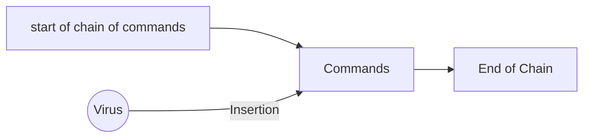

# Virusses Revealed

further Reading

http://victoria.tc.ca/techrev/vrfresft.htm

http://sun.soci.niu.edu/~rslade/vrfresft.htm

http://www.osborne.com/errata/errata.shtml

http://www.viruses-revealed/org.uk

## Computer virus': fact and fallacies

There is a large number of fallacies on computer virus'. As of 2001, amongst the media and research gathered, ==97%== of the data was all fallact. The measurement wasn't of incorrect information either, it was of incorrect logic and idea's.

Within the IT industry there are a lot of _quick experts_ who claim to know a lot about the industry, but don't, and prove the saying - _"a little knowledge is a dangerous thing"_

**Viruses** - or any kind of self-reproducing program, only use functions that that are used by other programs and are necessary for other operations.

**Malware** - any kind of virus, worm or trojan horse.

definiton of virus (from the 'short course on computer virus' by Dr. Frederick Cohen) - a program that can infect other programs by modifying them to include a, possibly evolved, copy of itself.

_Infecting_ involves the program inserting itself into a chain of command, so that when executed a legitimate programs results in the execution of the virus as well as the program.

> **Note**: not every program that destroys or steals data is a virus

### Virus Structure

The structure of a virus can the split into a commond tripartite model:

> **_Infection_** - a mechanism that in which the programs is spread
>
> **_Playload_** - if the program returns something, or does something other than replicate, this product is the payload.
>
> **_Trigger_** - This is the routine that decides when the payload (if there is one) is delivered

Only the presence of the _Infection_ needs to be found for a virus to be `viral`. Both _payload_ and _trigger_ are optional.

This is a very dumbed down version of a virus, but things can easily be convoluted when interprating virus'. For example, when disseminating the defintions above, whenever you see a virus, `infection` itself can be seen as a `payload` when you consider the aim of a `worm`. When you also think about the circumstances the `infection` decides to adopt when choosing to spread, this criteria of choice can be viewed as the `trigger`, and with a simple example you like this you have easily incorporated the 3 parts of the structure.

### Damage

The defitions of `damage` in context of a `virus` are one or more of the following:

> Deliberate damage to a machine through the payload of the virus (if one exists), such as trashing or intentional corruption of files.

> Accidental damage caused to the `victim's syste`  when attempting to install itself onto the newly infected host. This can take form of some of the `victim's system`  being corrupted and inabling the victim to boot.

> Incidental infeciton due to the inherittance of the virus itself. 
>
> **nearly all virus' will fall under this category as inheritting a virus inevitably leads to poor performance due to theft of memory, disk space, clock cycles, system modifications or a combination of any of the listed**

attemps to conceal a virus, or other malware, entail a measure of intentional or accidental damage due to the manipulation of the enviornment/configuration in order to conceal the virus. These manupulations can take form in any of the following:

> The dissapearence of word menu options relating to the presence of macros

> Encryption or displacement of system areas, such as the `Master Boot Record`

> Mainupaltion of the `Windows Registry`

> Traching or corruption of legitimate macros as part of the installation of the macro virus(s)

