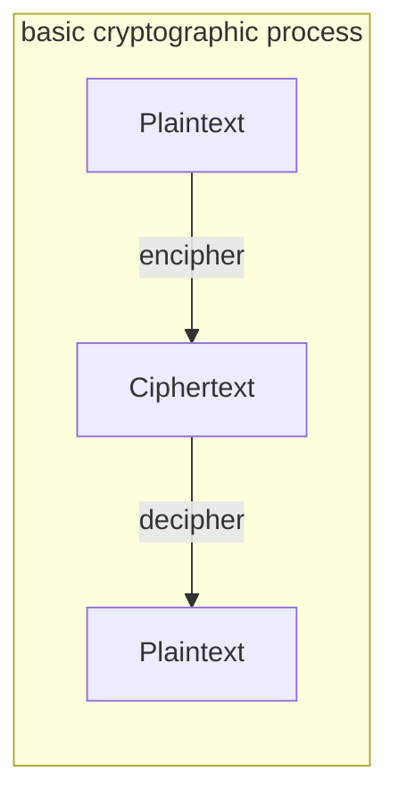

# applied cryptography

~~basics~~

within the realms of cryptography there are 2 main types of cyprting:

* hiding files from your friends and family so that nobody can read them
* hiding files from the government so that nobody can read them

the book focusses on the latter.

taking a letter, putting it into a safe, then putting that safe somewhere in a massive city and asking you to read the letter is not security - it's obscurity (n; the quality of being unclear and obstruse or hard to understand)

however, taking a letter, placing it into a safe, giving the safe away with the design specs, placing it with hundreds of similar safe's and allowing a world of cryptographers to attempt to crack it with no success is security.

## 1.1 Terminology

`Sender and Receiver` - this is communication between somebody who wants to securely send a message (sender) to somebody who it intended to read it (receiver)

A `message` is known as a `plaintext (or cleartext)`. The process of hiding a messages' substance is known as `encryption` and the encrypted message is called `ciphertext`. Turning a `ciphertext` back into `plaintext` is called `decryption`.

**Note** - some cultures refer to `encrypt ` and `decrypt` as `encipher` and `decipher` because the former can be offensive, as it refers to the dead.

`cryptography` - The art of keeping a message `encrypted`.

`cryptology` - the mathematics behind `enciphering` and `deciphering` a message.



in the following equations, `plaintext` is denoted by **M**, for message or **P** for plaintext. This can be any kind of file format from a stream of bits, a text file, a stream, digitized recording, etc. The `plaintext` can be used for either transmission or storage. 

`ciphertext` is denoted by **C**, which is also binary data; **C** can be the same size as **M** or sometimes larger with regards to bit size. (Note: by combining `Encryption` with `Compression`, **C** can be smaller than **M**, but you cannot acheive this with just `Encryption`).

```restructuredtext
E(M) = C
```

This mathematical notation states that when the `encryption` function (**E**) operates on the `plaintext` (**M**), then a `ciphertext` is produced (**C**).

In the reverse process, the `decryption` function (**D**) operates on the `ciphertext` (**C**) to produce **M**.

```restructuredtext
D(C) = M
```

Since the process of `enciphering` and `deciphering` a message is to acquire the original `plaintext`, the following notation must hold true:

```restructuredtext
D(E(M)) = M
```

## Authentication, Integrity and Nonrepudiation

Cryptography has many uses beyond encypting files, and can often be asked to do other things like:

> `Authentication` - it's possible for the receiver of a message to return the original plaintext without any issue, and an imposter shouldnt be able to masquerade as another person.

> `Integrity` - A receiver of a `plaintext` should be able to prove that they haven't tampered with the message and that it hasn't been modified in transit. An imposter shouldn't be able to substitute a false message with the original

> `Nonrepudiation` - A sender should not be able to falsely deny later that they sent a message.

These are the keys are help people, and computers, knwo the each end and person involved in the message is truly who they claim to be. These vital steps and aspects of a tranmission prove the the receiver and the sender that during the entirity of the tranmission, nobody is lying.

##  Algorithms and keys

**Cryptographic Algorithms**, or so called **ciphers**, are

